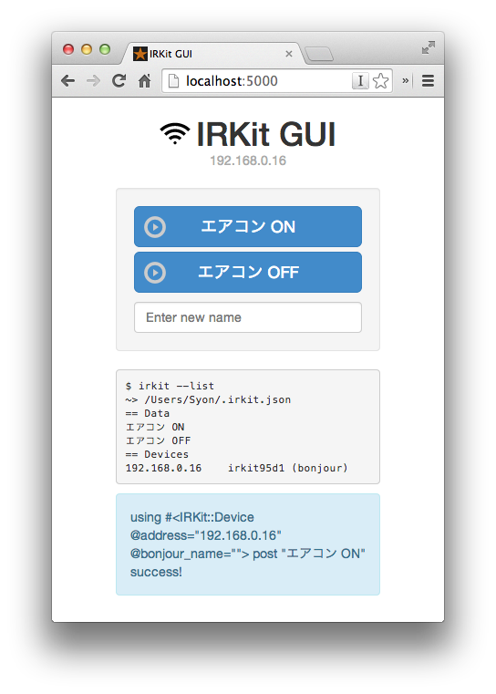

IRKit GUI
=========




## 仕組み

#### IRKit GUI (Sinatra) --> RubyGem`irkit` / `$ irkit` --> IRKit 本体

> [気づいたら IRKit GUI つくってた \- syonx](http://syonx.hatenablog.com/entry/2014/08/12/011046)


## インストールと実行

実行環境に Docker を採用しています。
動作前提を固定することで環境依存の問題を極力回避することを目的としています。

- [Docker \- Build, Ship, and Run Any App, Anywhere](https://www.docker.com/)

Docker のインストールができたら、このリポジトリを clone します。

```bash
$ git clone https://github.com/syon/irkit-gui.git
```

すでに RubyGem "irkit" で運用している場合はホームディレクトリにある IRKit の赤外線記憶データ `.irkit.json`（隠しファイル） を `irkit-data` ディレクトリにコピーします。

```bash
$ cd irkit-gui
$ cp ~/.irkit.json ./irkit-data/
$ ls -a ./irkit-data/
.           ..          .gitkeep    .irkit.json
```

Docker を起動します。スクリプト内でビルドと実行を行っています。

```bash
$ sh start.sh
```

- ブラウザでサーバにアクセスすると、上記のような画面が表示される
- 上記の例、サーバ自身のブラウザの場合は http://localhost:5000
- iPhone など他のデバイスからアクセスする場合は IP を指定するなど
    - Mac だと`$ ifconfig | grep "inet "`で表示される`192.168.0.123`とか


## 使い方

### ボタンを追加する
0. IRKit 本体にリモコン信号を記憶させる
0. GUI の "Enter new name" のところに好きな名前を入力して Enter

### 赤外線信号を発信する
- ボタンを押す

### ボタンを削除する
コマンドからどうぞ。
```bash
$ bundle exec irkit --delete "the name"
```

### 設定
__config.yml__ のサンプル

```bash
IRKIT_ADDRESS: 192.168.0.16
```

- __IRKIT_ADDRESS__
    - IRKit に IP アドレス指定で接続する
        - Bonjour が不安定なときなど
- __IRKIT_DATA_DIR__
    - 登録した赤外線信号のデータファイルのありか
        - RubyGem "irkit" が管理している
        - デフォルトはホームディレクトリ


## 便利なもの

- Bonjour Browser
  - [Tildesoft](http://www.tildesoft.com/)
