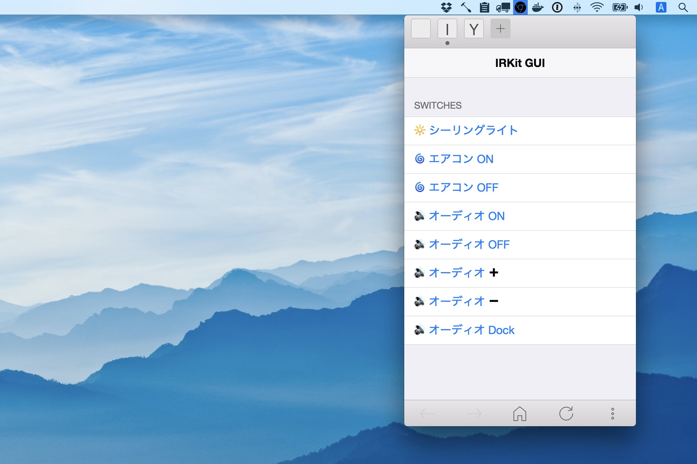

IRKit GUI
=========



- [気づいたら IRKit GUI つくってた \- syonx](http://syonx.hatenablog.com/entry/2014/08/12/011046)
- [iOS10新アプリ「ホーム」とSiriでエアコンをON/OFFしてみた（Homebridge・IRKit） \- syonx](http://syonx.hatenablog.com/entry/2016/09/19/181702)
- [IRKit GUIをDockerに対応してメニューバーから使えるようにしました \- syonx](http://syonx.hatenablog.com/entry/2017/01/08/223522)


## 想定利用シーン

- すでに IRKit を運用している
- PC から IRKit に命令を出したい
- コマンドでなく GUI で
- Mac のメニューバーから呼び出したい → [Chromenu が便利](http://syonx.hatenablog.com/entry/2017/01/08/223522)


## 準備

`DEVICE_ID`・`CLIENT_KEY` を用意します。Bonjour が機能しない場合は `IRKIT_ADDR` に IRKit のアドレスを記載します。

__.env__
```bash
IRKIT_ADDR=192.168.x.x
DEVICE_ID=XXXXXXXXXXXXXXXXXXXXXXXXXXXXXXXX
CLIENT_KEY=XXXXXXXXXXXXXXXXXXXXXXXXXXXXXXXX
```

- [IRKit \- Open Source WiFi Connected Infrared Remote Controller](http://getirkit.com/#toc_6)


## インストールと実行

実行環境に Docker を採用しています。
動作前提を固定することで環境依存の問題を極力回避することを目的としています。

- [Docker \- Build, Ship, and Run Any App, Anywhere](https://www.docker.com/)

Docker のインストールができたら、このリポジトリを clone します。

```bash
$ git clone https://github.com/syon/irkit-gui.git
```

すでに RubyGem "irkit" で運用している場合はホームディレクトリにある IRKit の赤外線記憶データ `.irkit.json`（隠しファイル） をプロジェクトルートディレクトリにコピーします。

__path/to/irkit-gui/.irkit.json__ (Sample)
```json
{
  "IR": {
    "tv_on": {
      "format": "raw",
      "freq": 38,
      "data": [17421,9061,1190, ...]
    },
    "tv_off": {
      "format": "raw",
      "freq": 38,
      "data": [17421,9061,1190, ...]
    },
  },
  "Device": {}
}
```

Docker を起動します。スクリプト内でビルドと実行を行っています。

```bash
$ sh start.sh
```

ブラウザまたは Chromenu で以下の URL にアクセスします。

- http://localhost:5005


## 赤外線信号の管理

あくまでこのWebアプリの役割はGUIによる信号の発信に留めていますので、赤外線信号の管理は RubyGem `irkit` を使います。これをインストールすると、コマンドラインから IRKit を制御できます。

- [shokai/ruby\-irkit: IRKit Client for Ruby](https://github.com/shokai/ruby-irkit)

このために Ruby をインストールせずに済むよう、こちらも Docker イメージ化してあります。

- [syon/irkit \- Docker Hub](https://hub.docker.com/r/syon/irkit/)

イメージの入手:

```bash
$ docker pull syon/irkit
```

あとは以下のコマンドでコンテナ内の irkit コマンドを実行します。スクリプト内部で手元の `.irkig.json` を Docker コンテナと共有しているので、編集した結果が同期されます。

```bash
$ sh irkit.sh
```

```
root@1dedbf1f51ef:~# irkit --get tv_on --address 192.168.0.123
```

## 便利なもの

- Chromenu
  - [rhysd/Chromenu: Mobile Chrome in your menubar](https://github.com/rhysd/Chromenu)
- Bonjour Browser
  - [Tildesoft](http://www.tildesoft.com/)
